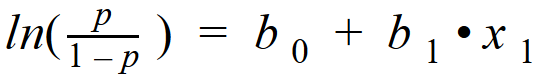
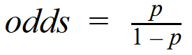
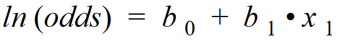
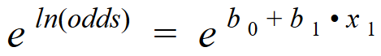
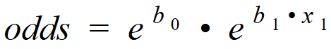
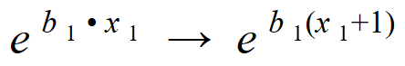
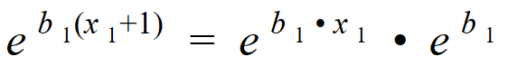

# Creating a Geosegmentation model to examine bank churn

A geosegmentation model examining the churn of bank customers using regression with Gretl.

# The Variables

* **RowNumber** - This column does not affect a persons decision
* **CustomerID** - A customers ID also does not affect their decision
* **Surname** - Surname is not a deciding factor either
* **CreditScore** - A customers credit score can affect their decision
* **Geography** - Regional data for where the customers are located
    + **Germany**
    + **France**
    + **Spain**
* **Gender** - The gender of a customer may play a role in whether they stay or leave
    + **Male**
    + **Female**
* **Age** - The age of a customer
* **Tenure** - The duration of a customers dealings with a bank - a longer tenure may build loyalty
* **Balance** - A customers bank balance - could affect promotions, interest rates, and account fees
* **NumOfProducts** - How many products a customer subscribes to - more products may lead to higher chances of staying
* **HasCrCard** - If a customer has a credit card with the bank or not - increases the banks presence in a customers life
* **IsActiveMember** - Customers activity with bank in the last 6 months - active customers could be more likely to stay
* **EstimatedSalary** - Banks estimate of a customers salary - higher earners may have more investments with the bank
* **Exited** - Whether a customers stays with the bank or leaves

Exited is the dependent variable as its the outcome of interest and this case study examines the factors that may be associated with a person leaving or staying at the bank. Dummy variables were created for gender and geography with male and France being the baselines respectively. This is so that only a single regression model has to be created.

Variables such as RowNumber, CustomerID, and Surname do not affect whether a person stays or leaves the bank and therefore these columns are not used. The remaining variables will be the regressors.

# Modeling the data

Running the first regression iteration results in the following coefficients and p-values:

| variables       | coefficients | p-values   |     |
|-----------------|--------------|------------|-----|
| const           | −3.92076     | 1.76e-057  | *** |
| CreditScore     | −0.000668329 | 0.0171     | **  |
| Age             | 0.0727060    | 2.52e-175  | *** |
| Tenure          | −0.0159491   | 0.0882     | *   |
| Balance         | 2.63707e-06  | 2.92e-07   | *** |
| NumOfProducts   | −0.101523    | 0.0312     | **  |
| HasCrCard       | −0.0446764   | 0.4515     |     |
| IsActiveMember  | −1.07544     | 1.43e-077  | *** |
| EstimatedSalary | 4.80699e-07  | 0.3102     |     |
| Female          | 0.528483     | 3.04e-022  | *** |
| Germany         | 0.774714     | 2.41e-030  | *** |
| Spain           | 0.0352178    | 0.6181     |     |

| R-squared | Adjusted R-squared | Accuracy (correct predictions) |
|-----------|--------------------|--------------------------------|
| 0.153161  | 0.150787           | 8103 (81.0%)                   |

It can be seen that the highest p-value was for Spain, which indicates that it is not a significant variable, therefore we can exclude Spain from the model. When modeling the data again without Spain, the accuracy does not increase and the R-squared value increases very slightly.

| variables       | coefficients | p-values   |     |
|-----------------|--------------|------------|-----|
| const           | −3.91097     | 1.41e-057  | *** |
| CreditScore     | −0.000666615 | 0.0174     | **  |
| Age             | 0.0727230    | 2.00e-175  | *** |
| Tenure          | −0.0159766   | 0.0876     | *   |
| Balance         | 2.63733e-06  | 2.91e-07   | *** |
| NumOfProducts   | −0.101288    | 0.0316     | **  |
| HasCrCard       | −0.0449303   | 0.4489     |     |
| IsActiveMember  | −1.07519     | 1.53e-077  | *** |
| EstimatedSalary | 4.81342e-07  | 0.3095     |     |
| Female          | 0.528343     | 3.11e-022  | *** |
| Germany         | 0.762937     | 2.16e-033  | *** |

| R-squared | Adjusted R-squared | Accuracy (correct predictions) |
|-----------|--------------------|--------------------------------|
| 0.153137  | 0.150961           | 8100 (81.0%)                   |

HasCrCard and EstimatedSalary are removed as these variables have the next highest p-values (above 0.05). After running the model agagin without these two variables there is a slight increase in accuracy and R-squared score. Now the model shows no variables with a p-value above the threshold.

| variables      | coefficients | p-values   |     |
|----------------|--------------|------------|-----|
| const          | −3.89591     | 2.31e-061  | *** |
| CreditScore    | −0.000666426 | 0.0174     | **  |
| Age            | 0.0727016    | 2.01e-175  | *** |
| Tenure         | −0.0159836   | 0.0873     | *   |
| Balance        | 2.65326e-06  | 2.44e-07   | *** |
| NumOfProducts  | −0.100475    | 0.0330     | **  |
| IsActiveMember | −1.07509     | 1.41e-077  | *** |
| Female         | 0.528981     | 2.74e-022  | *** |
| Germany        | 0.762059     | 2.43e-033  | *** |

| R-squared | Adjusted R-squared | Accuracy (correct predictions) |
|-----------|--------------------|--------------------------------|
| 0.152978  | 0.151197           | 8115 (81.2%)                   |

## Log transformation - Balance

Since balance has a large range and a one unit increase from 1000$ to 2000$ shows a doubling effect while a unit increase from 10,000$ to 11,000$ is only a 10% increase, we need to adjust the values so they scale. To do this the log will be taken and 1 will be added to each row in case theres a 0 balance.

This is done in Gretl by defining a new variable and entering the equation log10(balance + 1). The following are the results with replacing balance with log_Balance:

| variables      | coefficients | p-values   |     |
|----------------|--------------|------------|-----|
| const          | −3.91258     | 3.84e-061  | *** |
| CreditScore    | −0.000674866 | 0.0160     | **  |
| Age            | 0.0726550    | 3.24e-175  | *** |
| NumOfProducts  | −0.0950198   | 0.0456     | **  |
| IsActiveMember | −1.07578     | 1.01e-077  | *** |
| Female         | 0.526721     | 3.97e-022  | *** |
| Germany        | 0.747595     | 1.44e-030  | *** |
| Tenure         | −0.0158791   | 0.0893     | *   |
| Log_balance    | 0.0690263    | 7.62e-07   | *** |

| R-squared | Adjusted R-squared | Accuracy (correct predictions) |
|-----------|--------------------|--------------------------------|
| 0.152787  | 0.151006           | 8127 (81.3%)                   |

## Derived variable - Wealth_Accumulation

A derived variable may represent some fields such as balance and age more accuractly. For example, younger people may have smaller balances and older people may have larger balances that grow with age. Alternatively, a young person may have a lucrative job and have a larger balance compared to an older person who may have lost thier savings. This metric may better represent the financial position of customers.
To create this derived variable, the log balance in a bank account can be divided by the age of the account holder. This variable is termed Wealth_Accumulation. The following results are obtained with Wealth_Accumulation as a part of the equation:

| variable            | coefficients | p-values   |     |
|---------------------|--------------|------------|-----|
| const               | −3.82758     | 1.18e-053  | *** |
| CreditScore         | −0.000675560 | 0.0160     | **  |
| Age                 | 0.0706681    | 2.00e-115  | *** |
| NumOfProducts       | −0.0955301   | 0.0446     | **  |
| IsActiveMember      | −1.07339     | 2.57e-077  | *** |
| Female              | 0.525712     | 4.88e-022  | *** |
| Germany             | 0.746337     | 2.13e-030  | *** |
| Tenure              | −0.0159252   | 0.0884     | *   |
| Log_balance         | 0.0950938    | 0.0004     | *** |
| Wealth_Accumulation | −4.33552e-05 | 0.2512     |     |

| R-squared | Adjusted R-squared | Accuracy (correct predictions) |
|-----------|--------------------|--------------------------------|
| 0.152918  | 0.150940           | 8123 (81.2%)                   |

## Dealing with multicolinearity

Having Wealth_Accumulation, Log_Balance, and age in the model may show a decrease in accuracy and a high p value as there is likely multicolinearity. Gretl can check for colinearity and the variance inflation factor (VIF). The VIF for Log_balance and Wealth_Accumulation are much higher than the other variables. 

| Variables                  | VIF   |
|----------------------------|-------|
| CreditScore                | 1.001 |
| Age                        | 1.450 |
| NumOfProducts              | 1.152 |
| IsActiveMember             | 1.011 |
| Female                     | 1.003 |
| Germany                    | 1.271 |
| Tenure                     | 1.001 |
| Log_balance                | 5.860 |
| Wealth_Accumulation        | 5.722 |

When taking out Log_Balance, the coefficient for Wealth_Accumulation deflates.

| Variables                  | VIF   |
|----------------------------|-------|
| CreditScore                | 1.001 |
| Age                        | 1.115 |
| NumOfProducts              | 1.118 |
| IsActiveMember             | 1.011 |
| Female                     | 1.003 |
| Germany                    | 1.187 |
| Tenure                     | 1.001 |
| Wealth_Accumulation        | 1.387 |

The metrics for the model containing only Wealth_Accumulation are:

| R-squared | Adjusted R-squared | Accuracy (correct predictions) |
|-----------|--------------------|--------------------------------|
| 0.151650  | 0.149869           | 8121 (81.2%)                   |

Taking the log of Wealth_Accumulation may possibly be a better metric than the untransformed variable. Including both log balance and log wealth accumulation shows the effects of colinearity with both VIF scores being ~700. 

This colinearity effect can be further seen by taking the log of Wealth_Accumulation and including it in the equation along side Log_Balance:

| Variables                  | VIF     |
|----------------------------|---------|
| CreditScore                | 1.001   |
| Age                        | 2.265   |
| NumOfProducts              | 1.152   |
| IsActiveMember             | 1.012   |
| Female                     | 1.003   |
| Germany                    | 1.270   |
| Tenure                     | 1.002   |
| Log_Wealth_Acccumulation   | 704.740 |
| Log_Balance                | 705.941 |

The metrics for the model containing both the Log_Balance and Log_Wealth_Accumulation variables are:

| R-squared | Adjusted R-squared | Accuracy (correct predictions) |
|-----------|--------------------|--------------------------------|
| 0.153511  | 0.151533           | 8125 (81.3%)                   |

When assessing performace with only Log_Wealth_Accumulation the metrics are:

| R-squared | Adjusted R-squared | Accuracy (correct predictions) |
|-----------|--------------------|--------------------------------|
| 0.152658  | 0.150878           | 8128 (81.3%)                   |

## Finalizing a model

When comparing the two models where one uses only Log_Wealth_Accumulation and the other only Log_Balance, the model with Log_Balance results in the higher R-squared score (0.151006) and an acuracy only one correct prediction short of the Log_Wealth_Accumulation accuracy (8127 vs 8128).

# Which variables have the most impact?

In order to determine which variablea are the most important in determiening the banks churn rates, the odds ratios for each coefficient need to be caluclated 

## Calculating the odds ratio

The equation for simple logistic regression:

 
 

 
 

The odds equation:

 
 

 
 

Subbing odds into the logistic regression equation (also known as log odds):

 
 

 
 

Take the exponent of each side:

 
 

 
 

Simplified:

 
 

 
 

Increasing a variable by one unit:

 
 

 
 

The exponenets show that an increase of one unit leads to a multiplicative effect:

 
 

# Conclusion

These ratios can be calculated in Gretl using the function package "odds ratios": 

| Variables      | Odds-ratio |
|----------------|------------|
| CreditScore    | 0.9993     |
| Age            | 1.0754     |
| Tenure         | 0.9842     |
| NumOfProducts  | 0.9094     |
| IsActiveMember | 0.3410     |
| Female         | 1.6934     |
| Germany        | 2.1119     |
| Log_Balance    | 1.0715     |

The results show that the most impactful variables are being German, female, and being an active member. The odds-ratio in this case is looking at which factors contribute to a customer leaving. Therefore, when looking at this bank's churn, a customer living in Germany or moving there increases their odds of leaving by a factor of 2.1119. Further, a customer being a female increases their odds of leaving by a factor of 1.6934. Being an active member on the other hand is indicative of a customer staying with the bank. Ultimately, if the bank would like to reduce churn and retain their customer base they would have to target their German customers - especially German females - and work on increasing these customer's activity with the bank.
