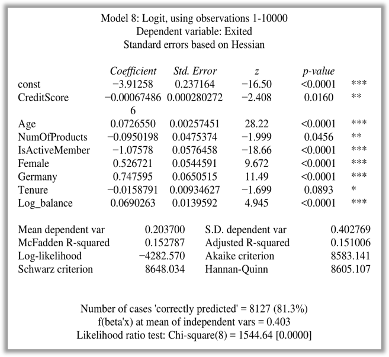

# Creating a Geosegmentation model to examine bank churn

A geosegmentation model examining the churn of bank customers using regression.

## The Variables

* **RowNumber** - This column does not affect a persons decision
* **CustomerID** - A customers ID also does not affect their decision
* **Surname** - Surname is not a deciding factor either
* **CreditScore** - A customers credit score can affect their decision
* **Geography** - Regional data for where the customers are located
    + **Germany**
    + **France**
    + **Spain**
* **Gender** - The gender of a customer may play a role in whether they stay or leave
    + **Male**
    + **Female**
* **Age** - May affect a customers decision to stay, for example an older customers may have loyalty to the bank
* **Tenure** - The duration of a customers dealings with a bank would affect their decision to stay or leave
* **Balance** - A customers bank balance
* **NumOfProducts** - How many products a customer subscribes to can influence their decision to stay or leave
* **HasCrCard** - Wether a customer has a credit card with the bank or not
* **IsActiveMember** - Has the customer been active in the last 6 months?
* **EstimatedSalary** - The banks estimate of a customers salary
* **Exited** - Whether a customers stays with the bank or leaves

Exited is the dependent variable as its the outcome of interest - what factors may be associated with a person leaving or staying at the bank. Dummy variables were created for gender and geography with male and France being the baselines respectively. This is so that only a single regression model has to be created.

Variables such as RowNumber, CustomerID, and Surname do not affect whether a person stays or leaves the bank and therefore these columns are not used. The remaining variables will be the regressors.

## Modeling the data

Running the first regression iteration shows the results in the following coeffiecents, statistics, and p-values:

| Variable        | coefficient  | p-value    |     |
|-----------------|--------------|------------|-----|
| const           | −3.92076     | 1.76e-057  | *** |
| CreditScore     | −0.000668329 | 0.0171     | **  |
| Age             | 0.0727060    | 2.52e-175  | *** |
| Tenure          | −0.0159491   | 0.0882     | *   |
| Balance         | 2.63707e-06  | 2.92e-07   | *** |
| NumOfProducts   | −0.101523    | 0.0312     | **  |
| HasCrCard       | −0.0446764   | 0.4515     |     |
| IsActiveMember  | −1.07544     | 1.43e-077  | *** |
| EstimatedSalary | 4.80699e-07  | 0.3102     |     |
| Female          | 0.528483     | 3.04e-022  | *** |
| Germany         | 0.774714     | 2.41e-030  | *** |
| Spain           | 0.0352178    | 0.6181     |     |

At the bottom, Gretl shows that the highest p-value was for Spain which indicates that it is not a significant variable, therefore we can exclude Spain from the model. When modeling the data again without Spain, the accuracy does not increase and the r-squared value increases very slightly.

When removing HasCrCard and EstimatedSalary, the next variables which have a high p-value (above 0.05), we see a slight increase in accuracy and r-squared value. Now the model shows no variables with a p-value above the threshold.

### Log transformation - Balance

Since balance has a large range and a one unit increase from 1000$ to 2000$ shows a doubling effect while a a unit increase from 10,000$ to 11,000$ is only a 10% increase, we need to adjust the values so they scale. To do this the log will be taken and 1 will be added to each row in case theres a 0 balance.

This is done in Gretl by defining a new variable and entering the equation log10(balance + 1). The following are the results with replacing balance with log_Balance:

### Derived variable - Wealth_Accumulation

A derived variable may represent some fields such as balance and age more accuractly. For example, younger people may have smaller balances and older people may have larger balances that grow with age. Alternatively, a young person may have a lucrative job and have a larger balance compared to an older person who may have lost thier savings. This metric may better represent the financial position of clients.
To create this derived variable, the log balance in a bank account can be divided by the age of the account holder. This variable is termed Wealth_Accumulation. The following results are obtained with Wealth_Accumulation as a part of the equation:

### Dealing with multicolinearity

Having Wealth_Accumulation, log_Balance, and age in the model may show a decrease in accuracy and a high p value as there is likely multicolinearity. Gretl can check for colinearity and the variance inflation factor (VIF). The VIF for log balance and wealth accumulation are much higher than the other variables. 

This colinearity effect can be further seen by taking the log of Wealth_accumulation and including it in the equation along side log_Balance:

When taking out log balance, the coefficient for Wealth_Accumulation deflates. 

Taking the log of wealth accumulation is a better metric than the variable alone. Including both log balance and log wealth accumulation shows the effects of colinearity with both VIF scores being ~700. However, when comparing the two models containing only log wealth accumulation and only log balance, the model with log balance results in the higher accuracy and r^2 score. 

